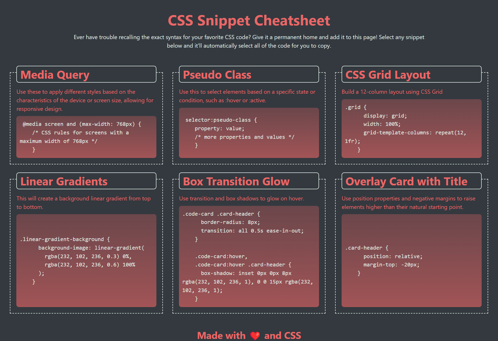

# 02 Mini-Project: CSS Snippet Cheat Sheet

## Despription 

* Used semantic HTML elements and proper indentation.

* Used CSS variables to maintain clean and reusable values for a color scheme.

* Used flexbox and media queries to create a responsive grid layout.

## Screenshot of Site

## Links

(https://github.com/awigginsjr/02-Mini-Project.git)

(https://awigginsjr.github.io/02-Mini-Project/)
